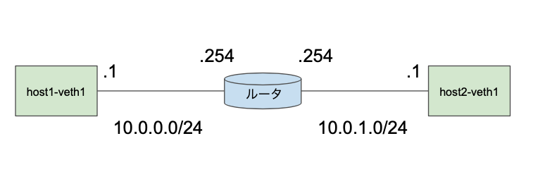

# toytcp

toy tcp implementation

# setup

```
$ cd toytcp
$ chmod +x setup.sh
$ ./setup.sh
```

The following virtual network environment will be created.



In order to avoid conflicts with the kernel's protocol stack, all packets with the RST flag are set to be discarded by iptables.


# build & run 

```
$ cargo build --examples
```

## echo-server & client

server
```
$ sudo ip netns exec host1 ./target/debug/examples/echoserver 10.0.0.1 30000
```

client
```
$ sudo ip netns exec host2 sudo ./target/debug/examples/echoclient 10.0.0.1 30000
```

## file upload

server
```
$ sudo ip netns exec host2 ./target/debug/examples/fileserver 10.0.1.1 40000 <save file name>
```

client
```
$ sudo ip netns exec host1 ./target/debug/examples/fileclient 10.0.1.1 40000 sample.jpg
```

## simulate packet loss

### Discard 0.1% of packets

```
$ sudo ip netns exec router tc qdisc add dev router-veth2 root netem loss 0.1%
```

Remember to turn off the settings when you're done experimenting.

```
sudo ip netns exec host2 tc qdisc del dev host2-veth1 root
```
